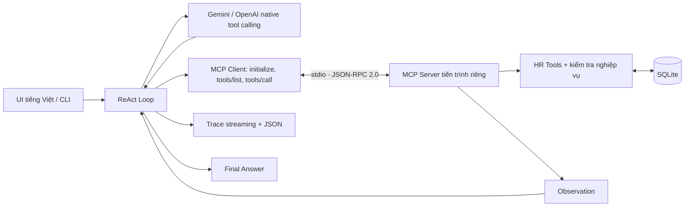

# PeopleOps — Trợ lý nhân sự ReAct + MCP

**Day 03 · Nguyễn Đức Tâm · 2A202602921 · Chủ đề 2.1: HR Assistant**

Tra cứu quỹ phép và chính sách, tính số ngày làm việc, tạo đơn nghỉ phép chờ duyệt. UI tiếng Việt có chat, so sánh Chatbot/ReAct, trace từng bước, danh sách đơn, chính sách và trang trình bày bài lab.

## Chạy demo

Mở PowerShell trong thư mục dự án:

```powershell
.\.venv\Scripts\python.exe -m pip install -r requirements.txt
.\.venv\Scripts\python.exe src\web.py
```

Mở **http://127.0.0.1:8000**. Có thể dùng `./run_demo.ps1` sau khi cài thư viện. Nếu cổng bận: `python src/web.py --port 8001`.

Nếu chưa có môi trường: `python -m venv .venv`. Python 3.10–3.12; dự án đã chạy thử với Python 3.12.

- **API thật:** đọc `LLM_PROVIDER`, `LLM_MODEL` và API key từ `.env`. Ưu tiên Gemini đã cấu hình. Không gửi key xuống trình duyệt.
- **Demo offline:** chọn ngay trong UI khi mất mạng. Đây là kịch bản xác định, không phải LLM; chỉ hỗ trợ câu mẫu, ngày cụ thể và thông tin đầy đủ trong một câu. Không dùng trace offline để chứng minh API thật.
- **ReAct Agent / Chatbot thường:** chuyển trong khung chat. Chuyển chế độ hoặc mở chat mới sẽ xóa lịch sử trò chuyện trên trình duyệt; các đơn đã lưu vẫn được giữ.
- **Góc trình bày:** có đủ năm nội dung trên bảng: đề tài, Agentic Fit, kiến trúc, tools, kịch bản demo. Có nút in/lưu PDF.
- **Tải Waterfall Trace:** xuất JSON phiên hiện tại, gồm model/provider, trạng thái live, các vòng lặp, tham số, kết quả, thời gian đo thực và token usage.

## Hai câu để trình bày

1. `Hãy tra cứu quỹ phép còn lại của NV001.`
2. `Tạo đơn nghỉ phép cho NV001 từ 21/09/2026 đến 23/09/2026, lý do: việc gia đình.`

Trên dữ liệu mới: NV001 có 12 ngày khả dụng → tạo đơn 3 ngày → còn 9 ngày, trạng thái PENDING. Xem Action/Observation rồi mở **Đơn nghỉ phép**. Gửi lại cùng nhân viên/khoảng ngày trả về đơn cũ, không trừ phép lần hai.

Tình huống đổi nhánh: `Nếu đủ phép, tạo đơn cho NV003 từ 21/09/2026 đến 25/09/2026, lý do: du lịch.` NV003 còn 1 ngày nên agent dừng tạo đơn.

## Kiến trúc



Schema JSON lấy từ hàm Python có type hints bằng Pydantic và công bố qua MCP; agent dùng schema được discovery từ server. Kết quả tool được đưa lại vào hội thoại **native** cho lượt LLM tiếp theo. Gemini giữ nguyên model content/thought signatures; OpenAI giữ tool_call_id. Xử lý mọi tool call trả về trong một lượt. Giới hạn 8 vòng và 12 tool calls; lỗi API hiển thị rõ, không tự chuyển thành mock.

| Tool | Vai trò |
| --- | --- |
| `hr_query` | Hồ sơ, phép khả dụng hoặc chính sách nhân sự demo |
| `calculate_leave_days` | Đếm ngày làm việc theo lịch demo, bỏ cuối tuần/ngày đóng cửa |
| `create_leave_request` | Ghi đơn PENDING, giữ chỗ phép, chặn trùng/chéo đơn và thiếu phép |
| `list_leave_requests` | Đọc danh sách và trạng thái đơn đã lưu |

## Kiểm thử và bằng chứng

```powershell
# 8 test nghiệp vụ bằng API thật, database tạm riêng từng test
.\.venv\Scripts\python.exe src\app.py --all

# Cùng bộ test bằng kịch bản offline
.\.venv\Scripts\python.exe src\app.py --all --offline

# Chat CLI; --baseline để chạy chatbot không tool
.\.venv\Scripts\python.exe src\app.py --interactive

# Test nghiệp vụ, MCP thực, native adapters và API web
.\.venv\Scripts\python.exe -m pip install -r requirements-dev.txt
.\.venv\Scripts\python.exe -m pytest -q

# Browser smoke test: Chrome/Edge cài sẵn, không tải Chromium
.\.venv\Scripts\python.exe scripts\browser_smoke.py
```

- [Báo cáo nghiệm thu](docs/trace_eval.md): Agentic Fit và kết quả thực tế.
- [Trace API thật](docs/trace_waterfall.json) / [trace offline](docs/trace_waterfall_offline.json): artifact tách riêng, không ghi đè nhau.
- [Kịch bản trình bày](docs/DEMO_SCRIPT.md): lời dẫn và thao tác demo.
- [Test cases](config/test_cases.json): 5 case chính + 3 case mở rộng, có assertions kiểm tra dữ liệu thay vì chỉ đếm đã chạy.
- Trace UI ở `data/traces/<run_id>.json`; trace CLI tương tác ở `data/last_cli_trace.json`. Không ghi đè artifact nghiệm thu khi demo.

## Dữ liệu và giới hạn

Đây là **workspace giả lập dành cho lab**, không kết nối hệ thống nhân sự VinFast. NV001/NV002/NV003 và mọi chính sách là hư cấu. SQLite lưu thật ở `data/peopleops.db`, tự tạo khi chạy; có thể đặt `HR_DB_PATH` để dùng database demo khác.

Ngày tham chiếu cố định **13/09/2026**, năm phép **2026**, tối đa 30 ngày lịch/đơn. Calendar bỏ thứ Bảy/Chủ nhật và 01/01, 30/04, 01/05, 02/09; đây không phải lịch nghỉ lễ pháp định đầy đủ. Đơn PENDING giữ chỗ quỹ phép nhưng chưa duyệt, không gửi email. Ghi dữ liệu dùng transaction SQLite `BEGIN IMMEDIATE` để tránh hai yêu cầu đồng thời tiêu quá số dư.

UI dành cho localhost, chưa có đăng nhập/phân quyền nhân viên, chưa có quy trình duyệt/hủy và chưa tích hợp HRIS. Lịch sử chat giữ trong bộ nhớ tab; reload sẽ xóa lịch sử, database vẫn giữ. API thật có thể yêu cầu bổ sung thông tin qua nhiều lượt. Trace “Thought” là tóm tắt hành động quan sát được, không lưu suy nghĩ nội bộ của mô hình. Bài lab không tự động commit, push hoặc nộp LMS.

## Cấu trúc

```text
src/          app.py, providers.py, prompts.py, tools.py, mcp_server.py,
              mcp_client.py, web.py
ui/           index.html, style.css, app.js (không cần Node build/CDN)
config/       test_cases.json, test_cases.example.json
tests/        nghiệp vụ, native adapters, MCP stdio, web API
scripts/      browser_smoke.py
 docs/        báo cáo, trace và tài liệu demo
 data/        database + trace runtime (gitignored)
```

## Nguồn kỹ thuật

Triển khai tool calling dựa trên [Gemini function calling](https://ai.google.dev/gemini-api/docs/function-calling), [OpenAI function calling](https://developers.openai.com/api/docs/guides/function-calling) và [MCP Python SDK v1](https://github.com/modelcontextprotocol/python-sdk/tree/v1.x). Tài liệu đề bài gốc giữ tại [CODELAB.md](docs/CODELAB.md).
