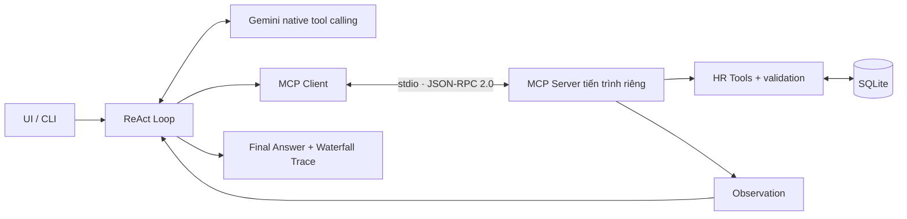

# Báo cáo nghiệm thu Day 03 — PeopleOps HR Assistant

**Học viên:** Nguyễn Đức Tâm · **Mã học viên:** 2A202602921
**Chủ đề:** 2.1 — Trợ lý nhân sự (HR & Operations)
**Repository:** https://github.com/tamnd2004/K4-DAY03-NguyenDucTam-2A202602921

## 1. Agentic Fit & Tool Specs — 25%

Nhân viên muốn nghỉ phép phải tra số dư, tính ngày làm việc, kiểm tra điều kiện rồi tạo đơn. Chatbot chỉ trả văn bản không thể biết số dư hiện tại hoặc ghi đơn. PeopleOps dùng ReAct để nối các bước đọc/ghi và đổi nhánh theo dữ liệu nhận được. Hồ sơ và chính sách trong bài là dữ liệu hư cấu, không phải chính sách chính thức của VinFast.

| Tiêu chí             |      Điểm | Giải trình                                                                        |
| -------------------- | --------: | --------------------------------------------------------------------------------- |
| Multi-step Reasoning |       5/5 | Tra hồ sơ → tính ngày → so sánh quỹ phép → tạo đơn → xác nhận mã đơn.             |
| Tool Interaction     |       5/5 | Cần đọc và ghi SQLite qua MCP; LLM không có dữ liệu này trong kiến thức sẵn có.   |
| Dynamic Decision     |       5/5 | Thiếu phép, sai mã, trùng đơn hoặc thiếu thông tin dẫn tới nhánh xử lý khác nhau. |
| Long Horizon Goal    |       2/5 | Mục tiêu ngắn trong phiên; chưa tự theo dõi duyệt đơn hoặc nhắc việc dài hạn.     |
| **Tổng**             | **17/20** | Phù hợp ReAct; chưa cần Autonomous Agent dài hạn.                                 |

Schema được sinh từ type hints bằng Pydantic, có `type`, `properties`, `required`, `additionalProperties=false`. MCP công bố schema qua `tools/list`; provider dùng chính schema discovery từ server. Router kiểm tra kiểu dữ liệu trước khi gọi hàm.

| Công cụ                | Input chính                                 | Tác dụng                                                 |
| ---------------------- | ------------------------------------------- | -------------------------------------------------------- |
| `hr_query`             | employee_id, topic (balance/profile/policy) | Tra hồ sơ, quỹ phép, chính sách demo.                    |
| `calculate_leave_days` | start_date, end_date (YYYY-MM-DD)           | Tính ngày làm việc, loại cuối tuần/ngày đóng cửa demo.   |
| `create_leave_request` | employee_id, start_date, end_date, reason   | Kiểm tra lại điều kiện, ghi đơn PENDING và giữ chỗ phép. |
| `list_leave_requests`  | employee_id                                 | Đọc danh sách và trạng thái đơn đã lưu.                  |

Bằng chứng: [tools.py](../src/tools.py), [8 test cases và assertions](../config/test_cases.json).

## 2. ReAct Loop & Native Tool Calling — 35%



Agent gọi LLM nhiều lượt, giữ model content/signatures và trả function response theo định dạng native. Mỗi lượt xử lý đầy đủ tool calls, đưa Observation vào lượt LLM kế tiếp. Chỉ kết thúc khi có Final Answer hoặc lỗi/giới hạn (8 vòng, 12 tool calls). Lỗi API không tự chuyển sang offline.

`create_leave_request` tự kiểm tra ngày, nhân viên, số dư, trùng/chéo đơn; transaction `BEGIN IMMEDIATE` giữ thao tác kiểm tra và trừ phép khả dụng nhất quán khi có yêu cầu đồng thời. PENDING chỉ là chờ duyệt, không phê duyệt hay gửi email.

**Model trong bằng chứng:** `gemini-3.5-flash-lite`.
**Lần chạy ghi nhận:** `2026-09-13T13:29:34.181386+00:00` (UTC).
**Kết quả API thật:** **8/8**; **12 tool calls**.

| Case | Tình huống             | Kết quả | Chuỗi công cụ                                          |
| ---- | ---------------------- | ------- | ------------------------------------------------------ |
| TC01 | direct_query           | PASS    | Không gọi tool                                         |
| TC02 | single_tool_query      | PASS    | hr_query                                               |
| TC03 | leave_request          | PASS    | hr_query → calculate_leave_days → create_leave_request |
| TC04 | conditional_multi_step | PASS    | hr_query → calculate_leave_days → create_leave_request |
| TC05 | unknown_employee       | PASS    | hr_query                                               |
| TC06 | insufficient_balance   | PASS    | hr_query → calculate_leave_days                        |
| TC07 | missing_details        | PASS    | hr_query                                               |
| TC08 | policy_lookup          | PASS    | hr_query                                               |

TC01–TC05 là năm case chính theo lab; TC06–TC08 mở rộng thiếu phép, thiếu thông tin và chính sách. Mỗi case chạy trên SQLite tạm riêng; kiểm tra trạng thái database, tham số, thứ tự đọc trước ghi, mã đơn xuất hiện trong câu trả lời và các Observation bắt buộc.

## 3. Waterfall Trace & Observation — 25%

Artifact: [trace_waterfall.json](trace_waterfall.json). File chứa model/provider, cờ `live`, run_id, timestamp, step, action_type, tham số, Observation, Final Answer, token usage và thời gian đo bằng `perf_counter`. Không gán latency giả. Thời gian lượt LLM trong chế độ nghiệm thu có thể bao gồm khoảng chờ `--pace` để hạn chế burst request.

**Thought** là tóm tắt hành động quan sát được (tool được đề xuất hoặc đã có phản hồi), không phải suy nghĩ nội bộ. Các trường `THOUGHT → ACTION → OBSERVATION → FINAL_ANSWER` có thể kiểm tra trực tiếp trong JSON và UI.

Trích các trường liên quan từ **TC04**, run_id **a4984ca9db6f425c9a0d42f06ab063b9** (giữ nguyên dữ liệu và thời gian đã ghi):

```json
[
  {
    "step": 1,
    "action_type": "THOUGHT",
    "latency_ms": 12583.34,
    "summary": "Đề xuất: hr_query, calculate_leave_days"
  },
  {
    "step": 1,
    "action_type": "ACTION",
    "latency_ms": 0,
    "tool_name": "hr_query",
    "arguments": {
      "employee_id": "NV002",
      "topic": "balance"
    }
  },
  {
    "step": 1,
    "action_type": "OBSERVATION",
    "latency_ms": 33.97,
    "tool_name": "hr_query",
    "observation": {
      "status": "SUCCESS",
      "employee": {
        "employee_id": "NV002",
        "full_name": "Lê Thu Hà",
        "department": "People & Culture",
        "position": "HR Specialist",
        "manager": "Phạm Hoàng Nam",
        "allowance": 16,
        "used": 8,
        "pending_days": 0,
        "available_days": 8
      },
      "policies": null,
      "source": "SQLite · dữ liệu nhân sự demo"
    }
  },
  {
    "step": 1,
    "action_type": "ACTION",
    "latency_ms": 0,
    "tool_name": "calculate_leave_days",
    "arguments": {
      "start_date": "2026-09-18",
      "end_date": "2026-09-22"
    }
  },
  {
    "step": 1,
    "action_type": "OBSERVATION",
    "latency_ms": 5.94,
    "tool_name": "calculate_leave_days",
    "observation": {
      "status": "SUCCESS",
      "start_date": "2026-09-18",
      "end_date": "2026-09-22",
      "days": 3,
      "workdays": ["2026-09-18", "2026-09-21", "2026-09-22"],
      "excluded_days": 2,
      "calendar": "Lịch demo 2026"
    }
  },
  {
    "step": 2,
    "action_type": "THOUGHT",
    "latency_ms": 15039.3,
    "summary": "Đề xuất: create_leave_request"
  },
  {
    "step": 2,
    "action_type": "ACTION",
    "latency_ms": 0,
    "tool_name": "create_leave_request",
    "arguments": {
      "end_date": "2026-09-22",
      "start_date": "2026-09-18",
      "reason": "du lịch cùng gia đình",
      "employee_id": "NV002"
    }
  },
  {
    "step": 2,
    "action_type": "OBSERVATION",
    "latency_ms": 22.16,
    "tool_name": "create_leave_request",
    "observation": {
      "status": "SUCCESS",
      "request": {
        "request_id": "LV-22591506",
        "employee_id": "NV002",
        "start_date": "2026-09-18",
        "end_date": "2026-09-22",
        "days": 3,
        "reason": "du lịch cùng gia đình",
        "status": "PENDING",
        "created_at": "2026-09-13T13:27:18.529934+00:00"
      },
      "manager": "Phạm Hoàng Nam",
      "available_days": 5,
      "message": "Đã tạo đơn chờ quản lý duyệt và giữ chỗ quỹ phép. Chưa được phê duyệt."
    }
  },
  {
    "step": 3,
    "action_type": "THOUGHT",
    "latency_ms": 15710.73,
    "summary": "Đã có phản hồi cuối"
  },
  {
    "step": 3,
    "action_type": "FINAL_ANSWER",
    "latency_ms": 0,
    "output": "Quỹ phép của bạn hiện còn 8 ngày. Sau khi tính toán, thời gian từ 18/09/2026 đến 22/09/2026 gồm 3 ngày làm việc (trừ cuối tuần). \n\nĐơn nghỉ phép của bạn đã được tạo thành công:\n- **Mã đơn:** LV-22591506\n- **Khoảng thời gian:** 18/09/2026 – 22/09/2026 (3 ngày)\n- **Lý do:** Du lịch cùng gia đình\n- **Trạng thái:** PENDING (Chờ quản lý trực tiếp là **Phạm Hoàng Nam** duyệt)\n- **Quỹ phép tạm tính sau khi giữ chỗ:** 5 ngày"
  }
]
```

### Kiểm chứng bổ sung

- Kiểm thử tự động: **26/26** đạt; [JUnit XML](test-results.xml).
- Bộ nghiệm thu offline: **8/8**; [trace offline](trace_waterfall_offline.json). Không dùng kết quả này thay cho API thật.
- UI trình duyệt: **passed**, 13 mục kiểm tra; [browser-results.json](browser-results.json). Gồm tra cứu, tạo đơn, số dư cập nhật, tải trace, bộ lọc, baseline, lỗi mạng và mobile.
- UI có bốn màn hình: Trợ lý AI, Đơn nghỉ phép, Chính sách, Góc trình bày; có in/lưu PDF và tải JSON trace.

## 4. Git Repository & Submission — 15%

Repository cá nhân: **https://github.com/tamnd2004/K4-DAY03-NguyenDucTam-2A202602921**.

`.env`, database runtime, cache và thư mục tạm được ignore. Không đưa API key vào báo cáo hoặc trình duyệt. Bản nộp gồm code, cấu hình mẫu, test cases, UI, báo cáo và trace.

Kiểm tra bản đã đẩy bằng `git status --short`, `git log -1 --oneline` và đối chiếu `git rev-parse HEAD` với `git ls-remote origin refs/heads/main`. Chi tiết bàn giao ở [SUBMISSION.md](SUBMISSION.md).

- [x] Đã chọn chủ đề và hoàn thiện 4 tiêu chí Agentic Fit.
- [x] Đã có JSON Schema, ReAct Loop, native tool calling và MCP stdio thực.
- [x] Tất cả test nghiệm thu API thật đã đạt.
- [x] Đã ghi trace và đưa đoạn trích thực tế vào báo cáo.
- [ ] Nộp đường dẫn repository vào bài Day 03 trên LMS VLearn; chưa có biên nhận nộp LMS.

## 5. Cách chạy và giới hạn

```powershell
.\.venv\Scripts\python.exe src\web.py
# Mở http://127.0.0.1:8000
.\.venv\Scripts\python.exe src\app.py --all
.\.venv\Scripts\python.exe src\app.py --all --offline
.\.venv\Scripts\python.exe -m pytest -q
```

Nguồn kỹ thuật: [Gemini function calling](https://ai.google.dev/gemini-api/docs/function-calling), [MCP Python SDK v1](https://github.com/modelcontextprotocol/python-sdk/tree/v1.x).
